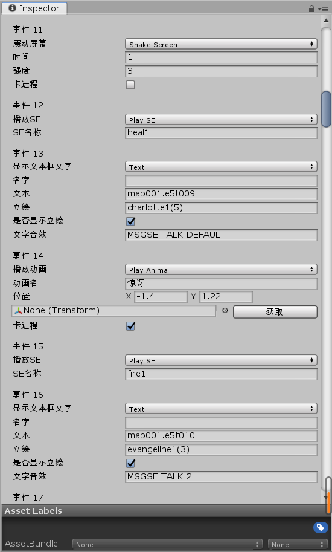
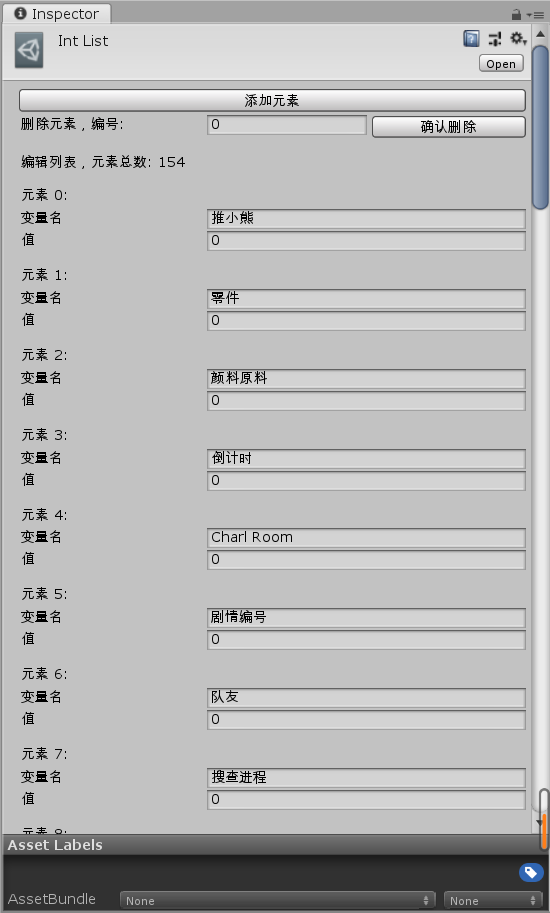
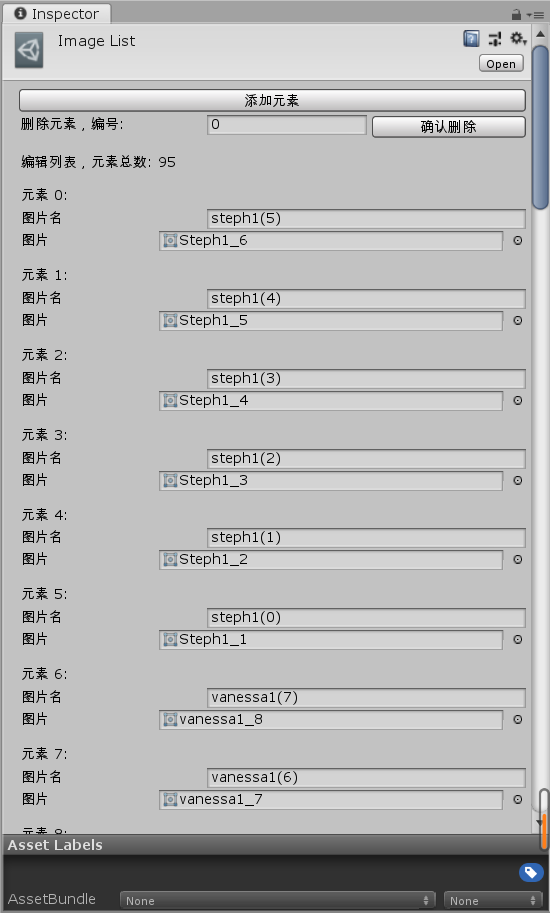

# RPGFrameWork
<a href="https://github.com/cafel176/ForText"><b>返回项目列表</b></a> 
因兴趣而自己研究的一套基于unity的RPG解密游戏框架，目标是为无计算机基础的开发者朋友省去代码工作。 
整体结构采用分层设计，表现层为定义好的游戏UI界面和用户输入处理；应用层存储游戏数据和管理游戏流程，负责数据与UI的解耦；业务层读取底层定义的数据信息，在应用层的控制下推进游戏流程；底层数据采用scriptobject保存。 
用户可在资源窗口内右键新建对应scriptobject文件，并通过使用写好的编辑器界面，在unity编辑器内自行设计相关的数据和功能文件而完成开发。 
 
 
<b>主要功能：</b> 
&nbsp;&nbsp;&nbsp;&nbsp;&nbsp;<a href="#jump1">1.流程控制</a> 
&nbsp;&nbsp;&nbsp;&nbsp;&nbsp;<a href="#jump2">2.全局变量</a> 
&nbsp;&nbsp;&nbsp;&nbsp;&nbsp;<a href="#jump3">3.资源管理</a> 
&nbsp;&nbsp;&nbsp;&nbsp;&nbsp;<a href="#jump4">4.数据结构体</a> 
&nbsp;&nbsp;&nbsp;&nbsp;&nbsp;<a href="#jump5">5.多语言</a> 
&nbsp;&nbsp;&nbsp;&nbsp;&nbsp;<a href="#jump6">6.UI系统</a> 
其余功能如存档，道具和任务系统，角色控制，场景可交互事件等等由Prefab提供。 

 
<b>1.流程控制： </b><a href="#jump">返回目录</a> 
用户可为游戏添加用于控制流程的事件列表，数据由采用Strategy模式的业务层类分析并由Singleton单件的应用层管理器通过UI呈献给玩家，事件列表支持以下用途。 
a. 剧情，场景内主线和支线流程的控制，与全局变量结合使用。 
b. 调查事件，调查场景内某些物品出现的重复事件，一次性事件等等。 
c. 公共事件，可在任何地方触发的一组全局事件，可用于道具效果的设计等。 
内置的事件目前未全部完成。 

 
<b>2.全局变量： </b><a href="#jump">返回目录</a> 
用户可自行添加对应的全局变量，包括整数浮点数和布尔型，之后可在流程文件中使用这些变量来进行解密流程的设计。 
游戏从头开始时系统会读取这些变量用来初始化游戏，这些变量初始化文件不会被系统修改 

 
<b>3.资源管理： </b><a href="#jump">返回目录</a> 
用户将资源拖入unity编辑器，在资源管理文件内设置资源和名称，在其他地方通过名称调用对应资源。 
因此类解密游戏流程复杂，资源重复使用相当频繁，采用资源管理器作为代理，以避免因替换某资源而导致大规模的修改原有流程文件。 

 
<b>4.数据结构体： </b><a href="#jump">返回目录</a> 
目前内置的常用数据结构体包括道具和任务两种。添加后可以直接在系统中使用。 
以后也在考虑支持用户自己定义结构数据体。 

 
<b>5.多语言： </b><a href="#jump">返回目录</a> 
用户可为游戏添加多语言支持，在系统内可以随时切换。 
如果认为在unity编辑器内编辑文本有所不便，也可以直接用文本编辑器编辑scriptobject文件来添加文本。 

 
<b>6.UI系统： </b><a href="#jump">返回目录</a> 
采用仅支持键盘的多层级窗口UI，在父窗口选择分类后可进入子窗口。修改窗口尺寸时采用Chain of responsibility，传递请求给顶层窗口以改变尺寸。 

